# Highly Available Web Architecture on AWS

**Multi-AZ • Auto Scaling • Application Load Balancing • RDS Multi-AZ • Failure Recovery**

This project demonstrates a cost-conscious, multi-AZ AWS architecture designed to remove the single-instance failure point of a basic EC2 web deployment. The environment used an internet-facing Application Load Balancer, EC2 Auto Scaling across two Availability Zones, a private Amazon RDS MySQL Multi-AZ database, layered security groups, CloudWatch target-tracking alarms, and automated EC2 bootstrap through User Data.

The strongest part of the project was not simply creating the resources: the application tier was deliberately broken by terminating one EC2 instance, the website remained available through the surviving Availability Zone, and the Auto Scaling Group automatically launched and registered a healthy replacement.

---

## Project Overview

A single EC2 instance is easy to deploy, but it creates an obvious reliability problem: if that instance fails, the application becomes unavailable.

This project replaced that design with a fault-tolerant AWS architecture:

- two EC2 application instances distributed across `us-east-1a` and `us-east-1b`;
- an Application Load Balancer routing requests only to healthy targets;
- an Auto Scaling Group maintaining baseline capacity and replacing failed instances;
- an RDS MySQL database deployed with Multi-AZ availability;
- private database subnets and security-group-based access control;
- automated Apache deployment through EC2 User Data;
- CloudWatch-backed target-tracking scaling;
- deliberate failure simulation and recovery validation.

The architecture was designed as a hands-on reliability lab rather than a production-ready platform. Cost, service necessity, and architectural trade-offs were considered throughout.

---

## Architecture

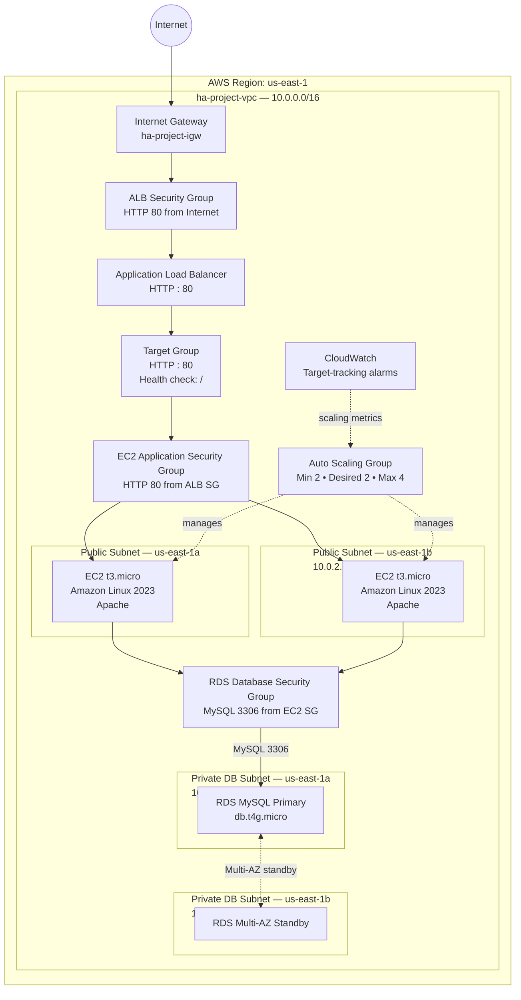

### Security path

```text
Internet
   ↓
ALB Security Group
   ↓ HTTP 80
EC2 Application Security Group
   ↓ MySQL 3306
RDS Database Security Group
```

---

## AWS Services Used

| Service | Purpose |
|---|---|
| Amazon VPC | Isolated project network |
| VPC Subnets | Public application tier and private database tier |
| Internet Gateway | Internet connectivity for public subnets |
| Route Tables | Public/private routing |
| Security Groups | Layered network access control |
| Amazon EC2 | Apache web/application instances |
| EC2 Launch Templates | Repeatable instance configuration |
| EC2 Auto Scaling | Desired capacity, scaling, and self-healing |
| Application Load Balancer | Multi-AZ traffic distribution and health-aware routing |
| Target Groups | EC2 registration and health checks |
| AWS IAM | EC2 instance profile/role |
| Amazon CloudWatch | Metrics and Auto Scaling target-tracking alarms |
| Amazon RDS for MySQL | Managed relational database |
| RDS Multi-AZ | Database high availability |
| RDS DB Subnet Group | Placement across private DB subnets |

---

## Network Architecture

### VPC

```text
ha-project-vpc
CIDR: 10.0.0.0/16
Region: us-east-1
```

### Public application subnets

| Subnet | Availability Zone | CIDR |
|---|---|---|
| `ha-public-subnet-1` | `us-east-1a` | `10.0.1.0/24` |
| `ha-public-subnet-2` | `us-east-1b` | `10.0.2.0/24` |

These subnets hosted the application-side EC2 capacity and were associated with the public route table.

### Private database subnets

| Subnet | Availability Zone | CIDR |
|---|---|---|
| `ha-private-db-subnet-1` | `us-east-1a` | `10.0.11.0/24` |
| `ha-private-db-subnet-2` | `us-east-1b` | `10.0.12.0/24` |

These subnets were used by the RDS DB subnet group.

### Routing

The public route table included:

```text
10.0.0.0/16 → local
0.0.0.0/0   → Internet Gateway
```

The database subnets used a separate private route table and had no direct internet route.

### Why no NAT Gateway?

A NAT Gateway was intentionally not created. This was a short-lived learning environment, and NAT Gateway hourly/data-processing charges were unnecessary for the project goals.

Because the application instances still needed outbound access for package installation, the EC2 instances used public IPv4 addresses in the public subnets. Inbound application traffic remained restricted through the ALB security group rather than being exposed broadly.

This was a lab cost trade-off, not a claim that public application instances are the preferred production design.

---

## Security Architecture

### ALB Security Group

`HA-Application-Load-Balancer-Security-Group`

Inbound:

```text
HTTP / TCP 80
Source: 0.0.0.0/0
```

The ALB was the public entry point.

### EC2 Application Security Group

`HA-EC2-Application-Security-Group`

Application HTTP traffic was accepted from the ALB security group rather than unrestricted internet sources.

SSH was not left permanently open. Temporary SSH access was added only when browser-based EC2 Instance Connect was required for the RDS connectivity test, and the temporary rules were removed immediately afterward.

### RDS Security Group

`HA-RDS-Database-Security-Group`

Inbound:

```text
MySQL/Aurora
TCP 3306
Source: HA-EC2-Application-Security-Group
```

This created a security-group chain:

```text
Internet → ALB → EC2 → RDS
```

The RDS database did not allow direct public access.

### Additional security controls

- EC2 instance role used instead of embedding AWS access keys.
- IMDSv2 enforced for EC2 metadata access.
- EBS root storage encrypted.
- RDS storage encrypted.
- RDS placed in private DB subnets.
- Temporary SSH access removed after validation.

---

## Implementation

### Phase 1 — Network Foundation

A custom VPC was created across two Availability Zones with two public application subnets and two private database subnets.

The public subnets were attached to an Internet Gateway through `ha-public-rt`. The private database subnets used `ha-private-db-rt`.

This established separate application and database network tiers while keeping the database off the public internet.

### Phase 2 — Compute and Load Balancing

A Launch Template was created using:

- Amazon Linux 2023
- `t3.micro`
- 8 GiB `gp3` root volume
- encrypted EBS
- IMDSv2
- IAM instance role
- Apache bootstrap through User Data

A Target Group was created on HTTP port `80` with health checks on `/`.

An internet-facing Application Load Balancer was deployed across both public subnets and configured to forward HTTP traffic to the Target Group.

### Phase 3 — Auto Scaling

The Auto Scaling Group used:

```text
Minimum capacity: 2
Desired capacity: 2
Maximum capacity: 4
```

Instances were distributed across `us-east-1a` and `us-east-1b`.

Both EC2 and Elastic Load Balancing health checks were enabled.

Target tracking used average CPU utilization with a target of approximately `50%`.

Scale-in was enabled, with a 300-second warm-up/grace period.

### Phase 4 — Multi-AZ RDS

Amazon RDS MySQL was created with:

- MySQL Community 8.4.9
- Multi-AZ DB instance deployment
- `db.t4g.micro`
- 20 GiB `gp3`
- encrypted storage
- private DB subnet group
- public access disabled
- password authentication
- Database Insights Standard
- RDS Proxy disabled

The private DB subnet group spanned `us-east-1a` and `us-east-1b`.

### Phase 5 — Validation

The ALB endpoint was refreshed repeatedly and returned pages generated by EC2 instances in both Availability Zones.

The EC2 application tier was then used to verify private RDS connectivity over port `3306`, followed by an authenticated MySQL session and actual database write/read operations.

### Phase 6 — Failure Testing

One EC2 instance in `us-east-1b` was deliberately terminated.

The application continued loading through the surviving `us-east-1a` instance.

The Auto Scaling Group detected the lost capacity, launched a replacement in `us-east-1b`, and restored the Target Group to two healthy instances.

### Phase 7 — Cleanup

After testing and evidence collection, project resources were intentionally removed to prevent unnecessary charges.

---

## EC2 User Data Bootstrap

The Launch Template used a bootstrap script with the following confirmed behavior. This is a sanitized reconstruction of the script used during the project.

```bash
#!/bin/bash

dnf -y update
dnf -y install httpd

systemctl enable httpd
systemctl start httpd

TOKEN=$(curl -X PUT \
  -H "X-aws-ec2-metadata-token-ttl-seconds: 21600" \
  http://169.254.169.254/latest/api/token)

INSTANCE_ID=$(curl \
  -H "X-aws-ec2-metadata-token: $TOKEN" \
  http://169.254.169.254/latest/meta-data/instance-id)

AZ=$(curl \
  -H "X-aws-ec2-metadata-token: $TOKEN" \
  http://169.254.169.254/latest/meta-data/placement/availability-zone)

cat > /var/www/html/index.html <<EOF
<h1>Highly Available AWS Web Application</h1>
<h2>Instance: $INSTANCE_ID</h2>
<h3>Availability Zone: $AZ</h3>
<p>Served through an Application Load Balancer and Auto Scaling Group.</p>
EOF
```

### Why this mattered

A replacement EC2 instance did not need to be configured manually. Auto Scaling could launch a fresh instance, User Data would install/start Apache and generate the page, and the instance could then pass the ALB health check automatically.

That made the recovery test a real self-healing workflow rather than a manual rebuild.

---

## Load Balancing Validation

The web page exposed the responding instance ID and Availability Zone.

### Response from `us-east-1a`

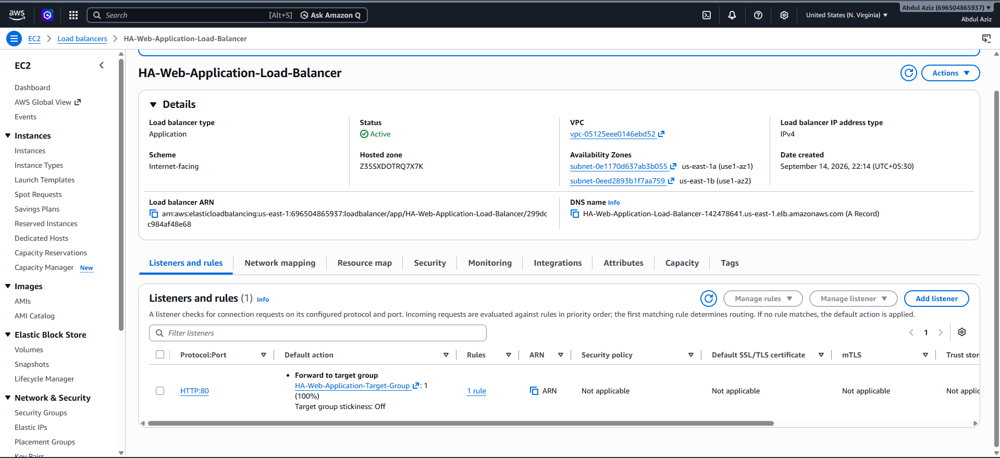

> **Figure 1 — Multi-AZ application response:** The ALB served the application from an EC2 instance in `us-east-1a`.

### Response from `us-east-1b`

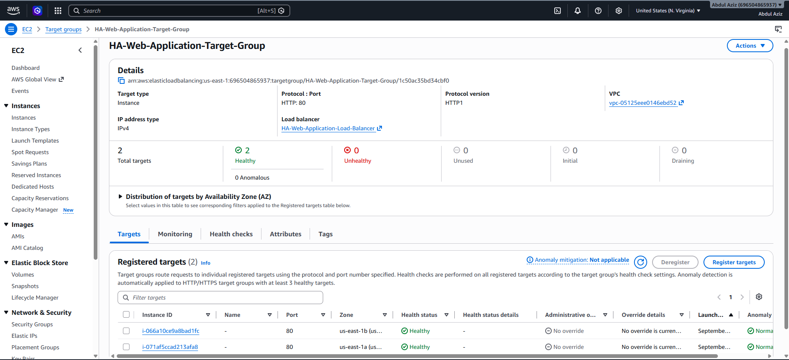

> **Figure 2 — Multi-AZ application response:** Refreshing the same ALB endpoint returned a response from an instance in `us-east-1b`.

Together, these responses proved that requests were reaching separate application instances across both Availability Zones.

---

## Application Load Balancer

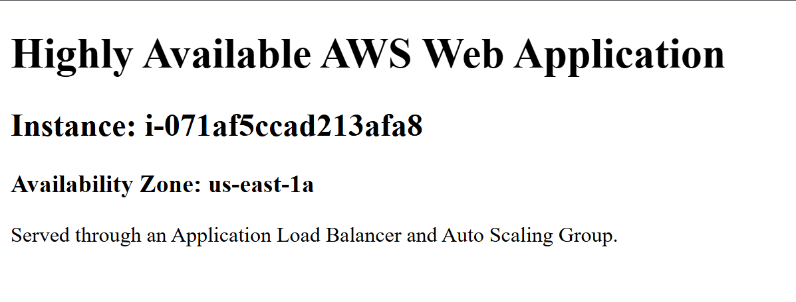

> **Figure 3 — ALB configuration:** The internet-facing Application Load Balancer was attached to public subnets in `us-east-1a` and `us-east-1b` and forwarded HTTP:80 traffic to the application Target Group.

The final Target Group state showed two healthy targets:

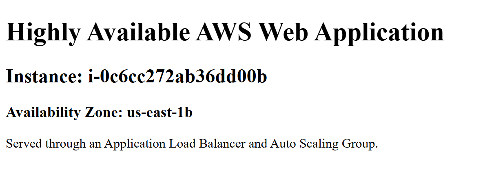

> **Figure 4 — Target health:** Both application instances were healthy after recovery, with one target in each Availability Zone.

---

## Auto Scaling Configuration

The application tier used:

```text
Min:     2
Desired: 2
Max:     4
```

Additional settings included:

- target tracking on average CPU;
- target approximately `50%`;
- scale-in enabled;
- EC2 + ELB health checks;
- 300-second health/warm-up period;
- Multi-AZ placement;
- availability-oriented replacement behavior;
- CloudWatch group metrics.

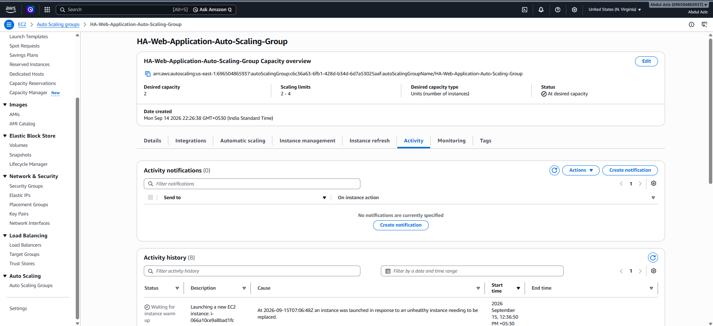

> **Figure 5 — Auto Scaling capacity:** The ASG maintained two baseline instances and allowed scale-out to four.

### Elasticity vs self-healing

These are related but different behaviors:

**Elasticity** changes capacity in response to demand, such as CPU utilization.

**Self-healing** restores desired capacity when an instance becomes unhealthy or disappears.

The project demonstrated both the target-tracking configuration and actual self-healing after an intentional EC2 failure.

---

## Failure Simulation and Automatic Recovery

This was the main reliability test.

### Initial state

Two EC2 instances were healthy:

```text
us-east-1a → i-071af5ccad213afa8
us-east-1b → i-0c6cc272ab36dd00b
```

Both passed all EC2 status checks.

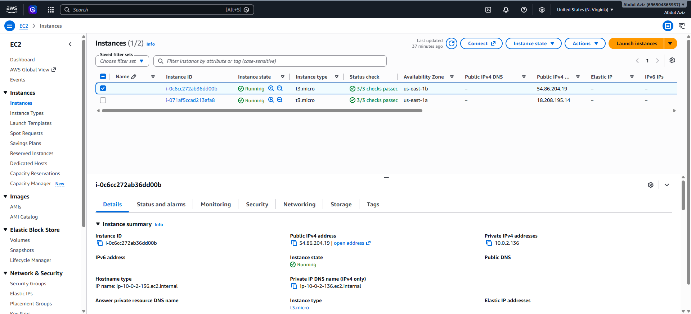

> **Figure 6 — Before failure:** Two healthy EC2 application instances were running across separate Availability Zones.

### Failure

The `us-east-1b` instance `i-0c6cc272ab36dd00b` was deliberately terminated.

The website continued loading through the surviving `us-east-1a` instance.

### Automatic replacement

The Auto Scaling Group detected that actual capacity had fallen below desired capacity and launched:

```text
i-066a10ce9a8bad1fc
```

in `us-east-1b`.

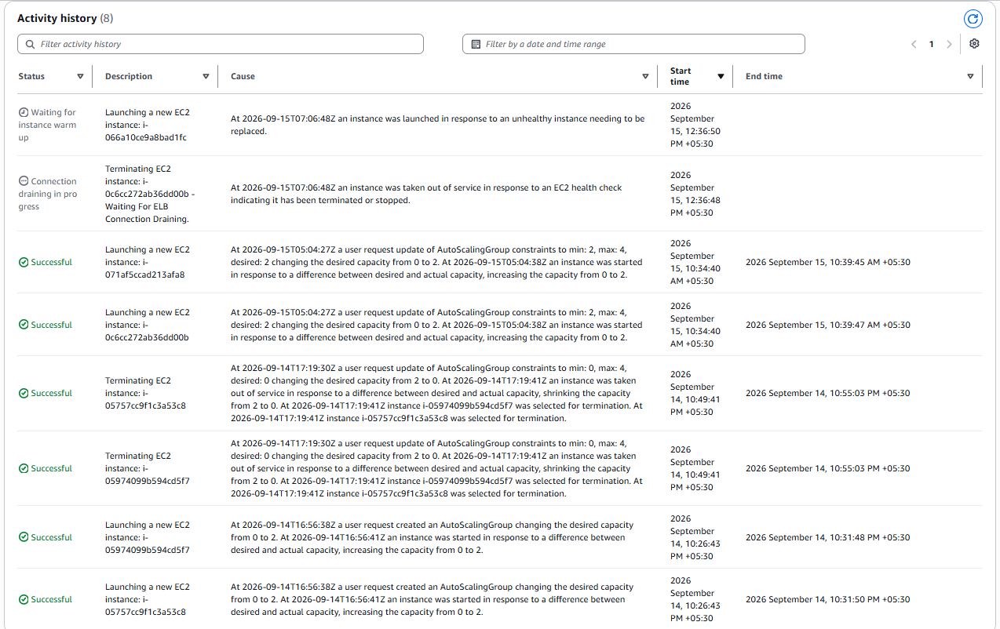

> **Figure 7 — Auto Scaling self-healing:** ASG Activity History recorded the replacement launch after the original instance was taken out of service.

The EC2 console then showed the terminated original instance together with the surviving instance and the new replacement:


> **Figure 8 — Recovery in progress:** The original `us-east-1b` instance was terminated while Auto Scaling created a replacement and preserved the surviving `us-east-1a` instance.

### Recovery validation

After the replacement became healthy, refreshing the ALB again produced a response from `us-east-1b`:

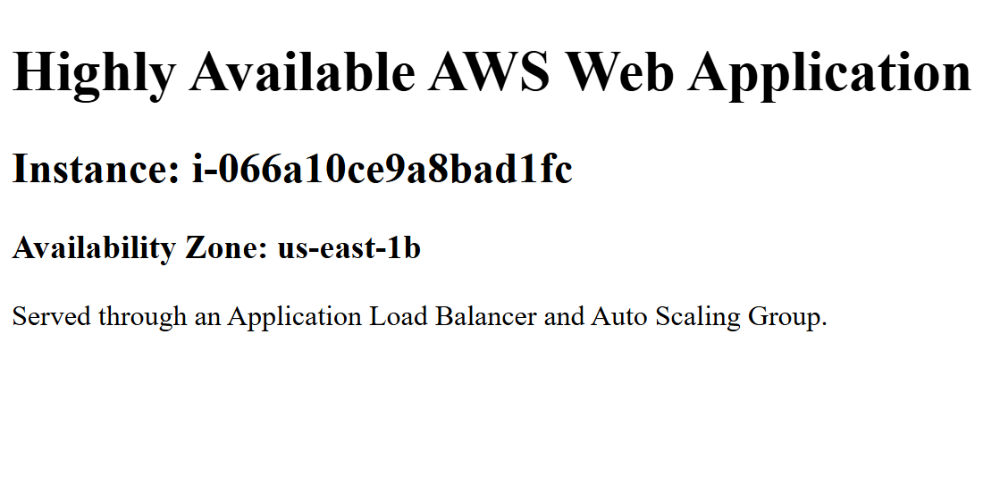

> **Figure 9 — Application recovered across both AZs:** The new replacement instance in `us-east-1b` successfully served traffic through the same ALB.

The Target Group returned to:

```text
Total targets: 2
Healthy:       2
Unhealthy:     0
```

### What this proved

The test demonstrated:

- **fault tolerance** — one application instance could fail without taking down the website;
- **health-aware routing** — the ALB continued serving through a healthy target;
- **desired-capacity enforcement** — Auto Scaling detected the capacity mismatch;
- **self-healing** — the failed instance was automatically replaced;
- **automated bootstrap** — the replacement configured Apache through User Data;
- **automatic registration** — the new instance entered the Target Group and became healthy;
- **Multi-AZ application availability** — capacity was restored across both AZs.

This was stronger evidence than simply showing that an Auto Scaling Group existed.

---

## CloudWatch and Target Tracking

The target-tracking scaling policy automatically created CloudWatch alarms.

The captured environment showed approximately:

```text
High CPU:
CPUUtilization > 50
3 datapoints within 3 minutes

Low CPU:
CPUUtilization < 35
15 datapoints within 15 minutes
```

The high alarm was `OK`, while the low alarm was `In alarm`.

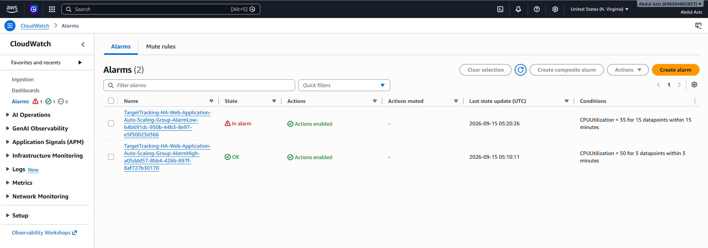

> **Figure 10 — Target-tracking alarms:** The low-utilization alarm being in ALARM state represented lightly loaded instances and the scale-in side of the target-tracking policy, not an application outage.

No separate custom application-availability alarm was created.

---

## RDS MySQL Multi-AZ

The database layer used:

| Setting | Value |
|---|---|
| Engine | MySQL Community |
| Version | 8.4.9 |
| Deployment | Multi-AZ DB instance |
| Instance class | `db.t4g.micro` |
| Storage | 20 GiB `gp3` |
| Encryption | Enabled |
| Public access | Disabled |
| Primary AZ | `us-east-1a` |
| Secondary AZ | `us-east-1b` |
| RDS Proxy | Disabled |
| IAM DB authentication | Disabled |
| Database Insights | Standard |

The standby existed for availability/failover and was not used as an application read replica.

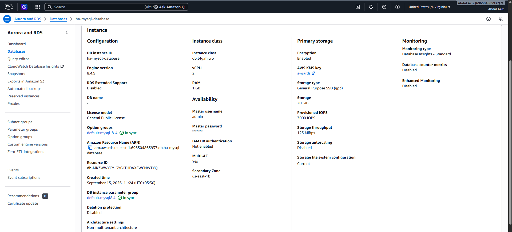

> **Figure 11 — Database high availability:** RDS was configured as a Multi-AZ MySQL deployment with the secondary database in a separate Availability Zone.

The database was placed in the private DB subnet group:

```text
10.0.11.0/24 — us-east-1a
10.0.12.0/24 — us-east-1b
```

Public access was disabled.

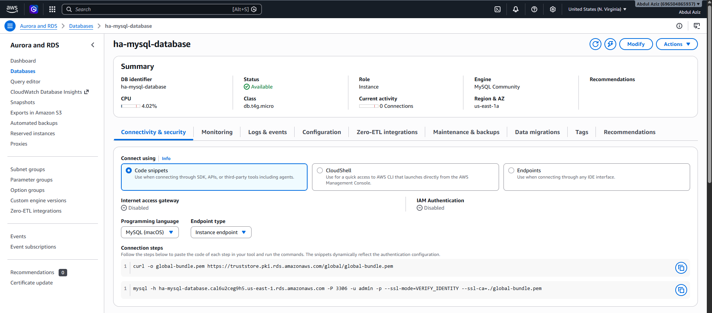

> **Figure 12 — Private database connectivity:** The RDS instance used private VPC connectivity rather than direct public internet access.

### Accuracy note

RDS Multi-AZ configuration was verified, but an intentional RDS failover was **not** performed during this project.

---

## EC2 → RDS Connectivity Test

The database layer was validated from an actual application EC2 instance.

### Install Netcat

```bash
sudo dnf install -y nmap-ncat
```

### Test MySQL port connectivity

```bash
nc -zv <rds-endpoint> 3306
```

The real test resolved the RDS hostname to a private VPC address and returned a successful connection:

```text
Connected to 10.0.11.248:3306
```

This verified:

- DNS resolution;
- VPC routing;
- private RDS addressing;
- RDS security-group access from the EC2 security group;
- TCP connectivity on MySQL port `3306`.

### Install MySQL/MariaDB client

```bash
sudo dnf install -y mariadb105
```

### Authenticate to RDS

```bash
mysql \
  -h <rds-endpoint> \
  -P 3306 \
  -u admin \
  -p
```

No password is stored in this repository.

### SQL validation

```sql
SELECT VERSION();
SELECT @@hostname;
SHOW DATABASES;
```

A test database and table were then created:

```sql
CREATE DATABASE ha_project_test;
USE ha_project_test;

CREATE TABLE connectivity_test (
    id INT PRIMARY KEY AUTO_INCREMENT,
    message VARCHAR(100)
);
```

A row was inserted:

```sql
INSERT INTO connectivity_test (message)
VALUES ('EC2 successfully connected to Multi-AZ RDS');
```

And read back:

```sql
SELECT * FROM connectivity_test;
```

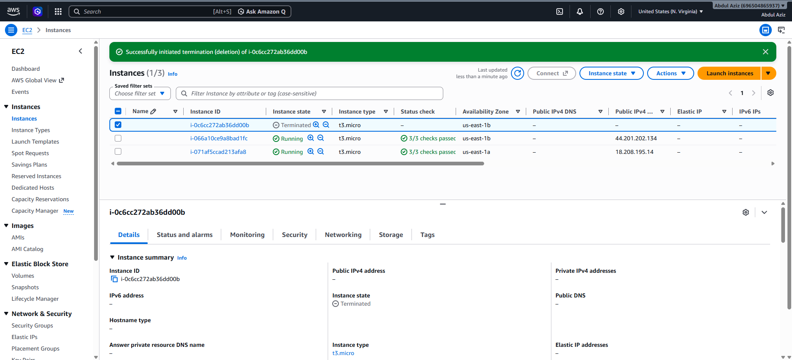

> **Figure 13 — Database validation:** The final SELECT returned the inserted row, proving EC2 → private RDS networking, authentication, database write, and database read.

---

## Cost-Conscious Design

Cost control influenced the architecture from planning through teardown.

### Small compute sizes

EC2 used:

```text
t3.micro
```

RDS used:

```text
db.t4g.micro
20 GiB gp3
```

The RDS console initially presented a much larger configuration with an estimated monthly cost around `$292`. The final lab configuration reduced that estimate to roughly `$27.96/month` if left running continuously.

These figures were planning estimates, not the final AWS bill.

### NAT Gateway avoided

A NAT Gateway was unnecessary for the learning objectives and would have added hourly and data-processing charges.

### No unnecessary paid integrations

The project did not deploy:

- RDS Proxy;
- Global Accelerator;
- WAF;
- CloudFront;
- paid domain/DNS requirements;
- Secrets Manager-managed RDS credentials.

### Temporary shutdown during a break

At one point the Auto Scaling Group was reduced to:

```text
Minimum: 0
Desired: 0
```

to terminate EC2 capacity overnight while preserving enough infrastructure to continue efficiently the next day.

### Immediate cleanup after validation

Once technical testing and evidence collection were complete, the environment was dismantled rather than left running.

---

## Architectural Decisions

### Why no NAT Gateway?

For this temporary project, the additional cost was not justified. Public EC2 addresses were used for outbound package installation, while inbound application access remained restricted to the ALB security group.

### Why no Route 53?

The project had one Application Load Balancer in one AWS Region.

Pointing Route 53 at that single ALB would add a service without meaningfully demonstrating DNS failover. A proper Route 53 failover design would require genuinely independent endpoints, for example:

```text
Route 53
├── Primary ALB — Region A
└── Secondary ALB — Region B
```

That would move the project into multi-region disaster recovery and materially increase scope and cost.

Route 53 was therefore intentionally excluded instead of being added simply to increase the service count.

### Why no EFS in the final architecture?

EFS appeared in the original course-inspired scope, and an EFS security group was prepared, but no EFS file system or mount targets were actually deployed.

EFS is therefore listed only as a future enhancement and is not shown in the implemented architecture.

---

## Problems Encountered and Solutions

| Problem | Cause | Resolution |
|---|---|---|
| AWS forms showed the default VPC | Console defaults did not match the custom architecture | Re-selected `ha-project-vpc` before creating resources |
| Launch Template storage/device confusion | Root AMI volume could be mistaken for an additional EBS disk | Kept and configured the AMI root volume instead of creating an unnecessary second disk |
| IMDS configuration needed correction | Initial metadata approach was not aligned with the desired security model | Enforced IMDSv2 and used token-based metadata requests |
| Target Group initially had no instances | Target Group was created before the ASG launched EC2 instances | Allowed ASG to register targets automatically |
| ALB endpoint initially timed out | Listener/access path was being checked against the wrong protocol/route assumptions | Verified SGs/routes and accessed the HTTP:80 endpoint explicitly |
| RDS Express configuration opened Aurora PostgreSQL Serverless | New console default workflow did not match the intended database | Cancelled and used full configuration with MySQL Multi-AZ |
| Opened DAX subnet groups instead of RDS subnet groups | Similar console navigation labels | Returned to Aurora and RDS → Subnet groups |
| RDS default sizing was expensive | Console selected a large DB class/storage configuration | Reduced to `db.t4g.micro` with 20 GiB `gp3` |
| `nc` command unavailable | Netcat was not installed on Amazon Linux | Installed `nmap-ncat` |
| Placeholder RDS endpoint was typed literally | Example placeholder was used instead of the real endpoint | Replaced it with the actual RDS hostname |
| MySQL authentication failed | Master password was not being accepted | Reset the RDS master password and retried successfully |
| SQL `CREATE DATABASES` error | Incorrect SQL keyword | Corrected to `CREATE DATABASE` |
| EC2 Instance Connect initially failed | SSH from the user's IP alone did not satisfy the browser connection path | Temporarily allowed the EC2 Instance Connect service CIDR shown by AWS, then removed SSH after testing |

---

## Results

The completed project demonstrated that:

- application traffic could be served across two Availability Zones;
- two EC2 instances could be maintained as baseline application capacity;
- the ALB routed only to healthy targets;
- one EC2 instance could fail without taking the application offline;
- Auto Scaling automatically restored desired capacity;
- the replacement instance bootstrapped Apache without manual configuration;
- the Target Group recovered to `2/2` healthy targets;
- RDS MySQL was configured with Multi-AZ availability;
- the database remained isolated from direct public internet access;
- EC2 successfully authenticated to RDS over private VPC networking;
- real SQL write and read operations succeeded;
- infrastructure was deliberately cleaned up after validation.

---

## Resource Cleanup

After all tests and screenshots were captured, the environment was intentionally dismantled to stop unnecessary charges.

Verified cleanup included:

- Auto Scaling capacity reduced to `0`;
- EC2 instances terminated;
- Application Load Balancer deleted;
- Target Group deleted;
- Auto Scaling Group deleted;
- Launch Template deleted;
- RDS database deleted;
- final RDS snapshot deleted;
- RDS DB subnet group deleted;
- project security groups deleted;
- project VPC deleted;
- project public/private subnets removed;
- route tables removed;
- Internet Gateway removed;
- no EBS volumes remained;
- no EBS snapshots remained;
- no Elastic IPs remained;
- no NAT Gateways existed;
- no project network interfaces remained;
- no custom AMIs remained;
- Auto Scaling CloudWatch alarms disappeared with the ASG;
- no RDS databases or RDS snapshots remained.

The account's default VPC and unrelated `Linux-WordPress-Key` key pair were deliberately preserved.

This cleanup demonstrated resource lifecycle management and cost governance rather than treating teardown as an afterthought.

---

## Skills Demonstrated

- AWS architecture and reliability design
- VPC and CIDR planning
- public/private subnet design
- route tables and Internet Gateway configuration
- layered security groups
- Application Load Balancing
- Target Groups and health checks
- EC2 Launch Templates
- EC2 Auto Scaling
- target-tracking scaling
- self-healing/failure recovery
- CloudWatch metrics and alarms
- IAM instance roles
- Amazon Linux 2023
- Apache
- Bash/User Data automation
- IMDSv2
- RDS MySQL
- RDS Multi-AZ
- private database connectivity
- SQL validation
- cloud cost awareness
- AWS troubleshooting
- resource cleanup and lifecycle management

---

## Future Improvements

The following were **not implemented** in this project and are future extensions:

- HTTPS with AWS Certificate Manager;
- Route 53 multi-region DNS failover;
- EFS shared storage;
- private EC2 application subnets;
- NAT Gateway or VPC endpoints where justified;
- AWS WAF;
- Secrets Manager;
- RDS Proxy;
- deliberate RDS failover testing;
- custom CloudWatch availability alarms and SNS notifications;
- Infrastructure as Code using Terraform or CloudFormation;
- CI/CD;
- centralized logging.

---

## Key Takeaway

The project was intentionally evaluated by **behavior**, not service count.

The most important validation was:

```text
Build
→ Load balance
→ Break one instance intentionally
→ Keep serving traffic
→ Auto-recover capacity
→ Validate the replacement
→ Verify private database connectivity
→ Perform real SQL read/write operations
→ Clean up the environment
```

That sequence demonstrates practical understanding of AWS reliability, networking, security, monitoring, and operational cost control.
